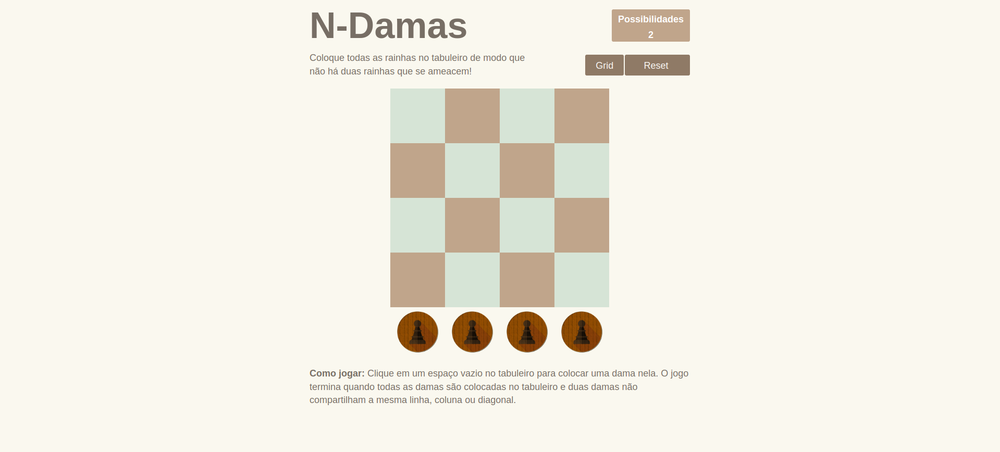
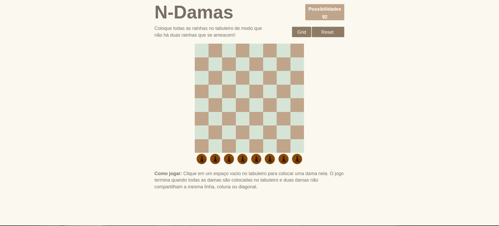
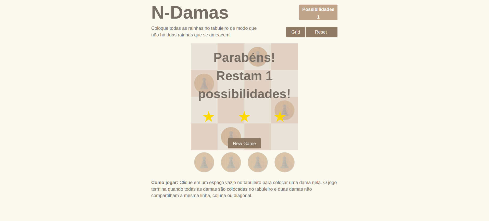
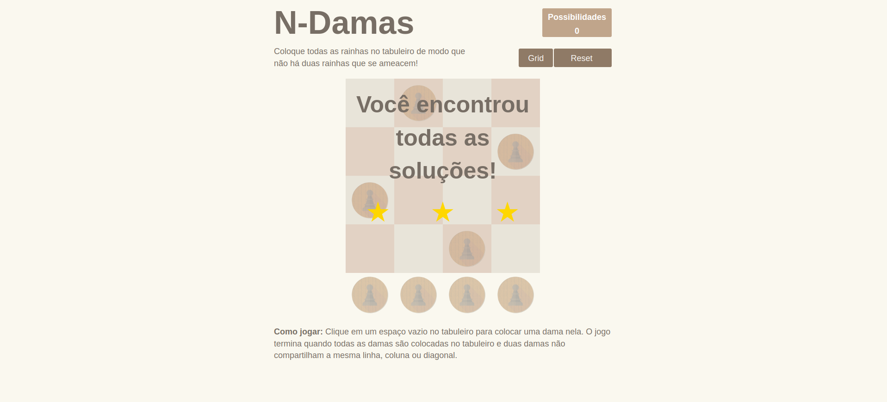

# N-Damas

**Conteúdo da Disciplina**: Grafos 1 

O trabalho é uma demonstração de como os DFS funcionam de forma visual.

## Alunos
|Matrícula | Aluno |
| -- | -- |
| 15/0005563  |  André Lucas Ferreira |
| 17/0039803	  |  Lucas Medeiros |

## Sobre 

No nosso jogo o desafio é um clássico de xadrez onde você deverá dispor as damas no tabuleiro de modo que nenhuma fique sob "ataque" de outra. Há um total de 92 soluções possíveis no tabuleiro máximo de 8x8.

Link para o vídeo de apresentação: [N-Damas](https://www.youtube.com/watch?v=78BMYTWKhWA)

## Screenshots

## Instalação 
**Linguagem**: JavaScript, HTML, CSS  
**Framework**: React  

## Instalação 

> Para clonar o projeto digite:

    git clone https://github.com/projeto-de-algoritmos/Grafos1_N_Damas.git

### Instalando o frontend

Para o front é necessário ter instalado o [node & npm](https://nodejs.org/en/).

Caso você esteja na raiz do projeto vá até a pasta do front-end digitando num terminal:

    cd jogo-n-damas

E instale as dependências necessárias com o comando:

    npm install

Após a instalação das dependências inicie o projeto:

    npm start
    
Agora basta acessar no seu navegador: http://localhost:8080/

## Uso 

1. Abra o navegador web de sua escolha e digite a url do projeto; 
2. Com o jogo aberto, selecione o tamanho do tabuleiro (grid) que deseja jogar;
3. Basta posicionar as damas de acordo com as regras do jogo e se divertir com as várias soluções. 

## Outros 
Quaisquer outras informações sobre seu projeto podem ser descritas abaixo.

